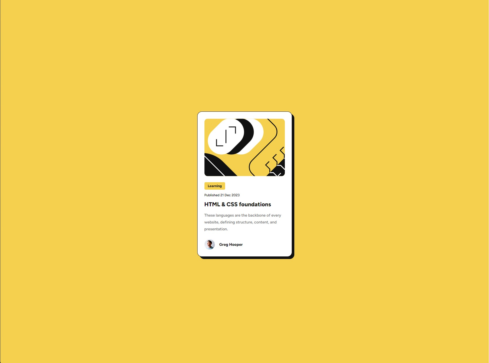

# Frontend Mentor - Blog preview card solution

This is a solution to the [Blog preview card challenge on Frontend Mentor](https://www.frontendmentor.io/challenges/blog-preview-card-ckPaj01IcS). Frontend Mentor challenges help you improve your coding skills by building realistic projects. 

## Table of contents

- [Overview](#overview)
  - [The challenge](#the-challenge)
  - [Screenshot](#screenshot)
  - [Links](#links)
- [My process](#my-process)
  - [Built with](#built-with)
  - [What I learned](#what-i-learned)
  - [Useful resources](#useful-resources)
- [Author](#author)
- [Acknowledgments](#acknowledgments)

## Overview

### The challenge

Users should be able to:

- See hover and focus states for all interactive elements on the page

### Screenshot

### Links

- Solution URL: [Frontend Mentor](https://www.frontendmentor.io/solutions/responsive-blog-preview-card-RqDUBOxo7u)
- Live Site URL: [Github pages](https://gian-noche.github.io/blog-preview-card-main/)

## My process

### Built with

- Semantic HTML5 markup
- CSS custom properties
- Flexbox
- Mobile-first workflow

### What I learned

A simple and fun challenge. The main takeaway with this one for me would be the thumbnail section for the image.
Since the one that was provided is larger than the end result's image resolution, it had to be cropped as such.

### Useful resources

- [Stackoverflow](https://stackoverflow.com/)
- [CSS Tricks](https://css-tricks.com/)

## Author

- Github profile - [pewpewhamster](https://github.com/gian-noche)
- Frontend Mentor - [@pewpewhamster](https://www.frontendmentor.io/profile/gian-noche)

## Acknowledgments

Thanks to Frontend Mentor for providing these amazing challenges! Keep it up guys! ^^
